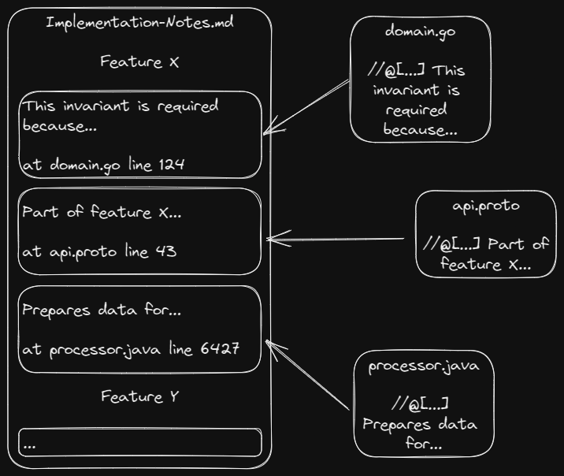

# Memorial


A CLI tool for collecting notes from the source code files (as comments) and compiling them into documentation files
using hierarchical structure separated from the source code file structure.

Main uses:

- Documenting domain implementation
- Unifying notes on features implemented across different layers/repos
- Organizing already existing comments

The idea behind this tool is based on the assumption that the most precise documentation should be written along with
the code itself by the person writing the code, i.e. the developer. This documentation should be kept as close as
possible to the source code to remain up-to-date. Not to mention all the benefits of keeping the documentation in VCS.

The idea is similar to Javadoc and other such tools with the main difference of separating documentation structure from
the code structure. The format is also less strict.



## Features

### Supported file types

| File type | Language / Format | 
|-----------|-------------------|
| .cs       | C#                |
| .go       | Go                |
| .java     | Java              |
| .js       | JavaScript        |
| .kt       | Kotlin            |
| .proto    | Protobuf          |
| .rust     | Rust              |

## Downloads

Current release: **v0.2.0** [Changelog](CHANGELOG.md)

Download and unzip binaries for your OS:

- [Windows x86-64](https://github.com/Kostassoid/memorial/releases/download/v0.2.0/memorial-cli-v0.2.0-x86_64-pc-windows-gnu.zip)
- [macOS Intel](https://github.com/Kostassoid/memorial/releases/download/v0.2.0/memorial-cli-v0.2.0-x86_64-apple-darwin.tar.gz)
- [macOS Apple](https://github.com/Kostassoid/memorial/releases/download/v0.2.0/memorial-cli-v0.2.0-aarch64-apple-darwin.tar.gz)
- [Linux x86-64](https://github.com/Kostassoid/memorial/releases/download/v0.2.0/memorial-cli-v0.2.0-x86_64-unknown-linux-musl.tar.gz)

## Usage

### Running

Running the CLI application with `scan` argument would read the configuration from the default path `./memorial.toml`,
scan the files and create documentation files according to the configuration settings.

```shell
./memorial-cli scan
```

You can customize the path to the configuration file:

```shell
./memorial-cli scan -c "another.toml"
```

### Running from Docker

There's also a pre-built Docker image you can use:

```shell
docker run --rm -it -v $(pwd):/src ghcr.io/kostassoid/memorial:v0.2.0
```

### Notes formatting

Note is a unit of information. Notes can come from different sources but for now only code comments are considered.
Any properly formatted comment block can be collected as a single note.

Full format of a note looks like this:

```
@[Handle]{Attribute:WithValue}{AttributeAsToggle}: Note body
```

#### Handle

`Handle` is the only required part. A note should start with it, otherwise it will be ignored. A `Handle` places the
note
within a documentation hierarchy, i.e. it points to a node in a tree.
The format of a `Handle` is similar to a path in a file system, for example `@[Domain/Aggregate/Invariants]`.
It's not required to have any intermediate nodes defined as well, they will be created automatically.
Each node can contain any number of notes.

#### Attribute

`Attributes` aren't part of the rendered document, but they control some aspects of collection and
rendering. `Attributes`
are assigned to the hierarchy nodes, not the individual notes (comments) with the only exception (see below).

`Attribute` can be written as a key-value pair, separated by `:` or it can be just a key, in which case it works kind of
like a toggle.

Most attributes are used internally. But the following attributes can be used additionally as part of the notes:

- `{title:XXX}`
    - overrides a title (or displayed name) of the node. Used by a renderer as a header/link title.
- `{do-not-collect}`
    - prevent a note from being added to the node. Primary use - setting node attributes.

For example, the following note:

```
//@[Foo/Bar]{title:A pretty name}: Some meaningful information
```

Can also be written as:

```
//@[Foo/Bar]{title:A pretty name}{do-not-collect}

...

//@[Foo/Bar]: Some meaningful information
```

#### Note body

`Note body` is basically the rest of the comment after the header (`Handle` + optional set of `Attribute`s) following
the separator `:`.
Note that if there's no `Note body` the separator is not required.
The note body is treated as a piece of Markdown. Which means that any plain text comment would work as well.

Additionally, it's possible to create links to nodes by using a `Handle`, e.g.:

```
//@[Foo/Bar]: Also see @[Baz] for additional context.
```

### Configuration

All configuration parameters are defined in a single TOML file. The default configuration file name is `memorial.toml`.

See [example configuration file](memorial-example.toml) for details.

## Current state

The project is still in an early stage, but it should work pretty well in certain environments already (e.g. monorepos).

I'm experimenting with the whole concept at the same time as I try to improve the usability. So things can change
quickly and drastically. Saying that, I'll do my best to respect semantic versioning and backward compatibility.

## Known issues / limitations

- [x] Using `{` character in notes causes parser to fail (needs support for escaping or a smarter parser definition)
- [ ] No way to fine-tune ordering for notes/nodes
- [ ] No support for multi-line comments using single-line syntax
- [ ] No support for indentations containing non-whitespace characters (like `*`)

## Roadmap

Additionally to fixing bugs and adding support for more file types, the following features seem interesting to explore:

- [ ] Localization
- [ ] Supporting more URL formats for popular code sharing platforms / engines (e.g. Bitbucket)
- [ ] Multi-file rendering
- [ ] Parallelized notes collection
- [ ] IDE support
- [ ] Collecting/rendering from multiple sources (e.g. for compiling notes from multiple repos)
- [ ] Distribution through Homebrew, apt, Scoop and other package managers
- [ ] Static analysis of the code files to figure out hidden dependencies

## License

[MIT](LICENSE)
